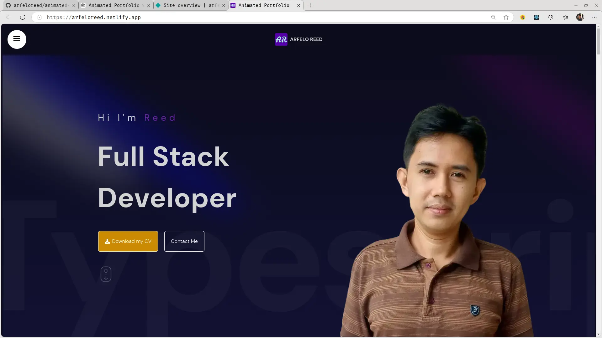

# Reed's Developer Portfolio

Welcome to my personal portfolio website showcasing my skills, projects, and professional background as a Full Stack Developer.

## 🛠️ Features
#### 1. Clean, Responsive Design
- Built with **TailwindCSS**, ensuring a clean, responsive UI that looks great on any device.
- Mobile-first design with flexible grid layouts for different screen sizes.
#### 2. Dynamic Animations
- **Framer Motion** is used for subtle animations, enhancing user engagement without compromising performance.
#### 3. Smooth Scrolling & Interactive Navigation
- Smooth scrolling functionality for easy navigation between sections.
- Downloadable CV and contact button available directly from the hero section for quick access.
#### 4. Functioning email sender
- Send me email directly throught the contact form. Powered by **web3forms** and
  notification handled by **sweetalert2**.

## 🚀 Tools & Technologies

### Frontend:
- **React-TS**: The portfolio is powered by **React** with **TypeScript** for a robust, scalable, and type-safe codebase.
- **Vite**: Ultra-fast development environment with quick build times.
- **TailwindCSS**: A utility-first CSS framework used to create a custom design effortlessly.
- **Framer Motion**: For modern, declarative animations and smooth transitions.
### Deployment
- Hosted on **Netlify** for a fast and scalable web app experience.

## ⚙️ How to Run Locally
1. Clone the repository:
```bash
git clone https://github.com/arfeloreed/animated-portfolio.git
```
2. Install dependencies:
```bash
cd animated-portfolio
npm install
```
3. Run the development server:
```bash
npm run dev
```

## 📄 License
This project is licensed under the MIT License.

<br />

### Live site:
See site live on netlify at [arfeloreed.netlify.app](https://arfeloreed.netlify.app/)

<br />

<div align="center">

</div>
